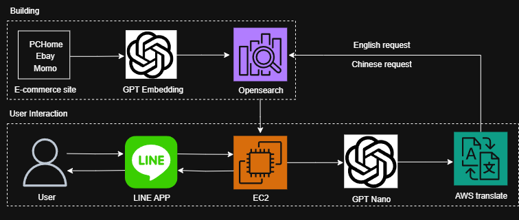

## line-shopping-gpt

> LINE ID: [@006whxns](https://line.me/R/ti/p/@006whxns)

## System Architecture

This system architecture supports a LINE-based chatbot for product search across PChome, Momo, and eBay. In the **building phase**, an EC2 instance crawls product data, uses GPT embeddings to vectorize product names, and stores them in OpenSearch. In the **user interaction phase**, users send queries via LINE. The EC2 server receives requests (via Nginx on port 443), uses GPT Nano to extract intent and filters(intented product, e-commercesite / ceil or floor price) and translates them using AWS Translate. It then queries OpenSearch using Chinese for local sites (PChome, Momo) and English for eBay, returning the most relevant results back to the user.